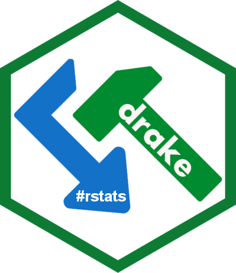
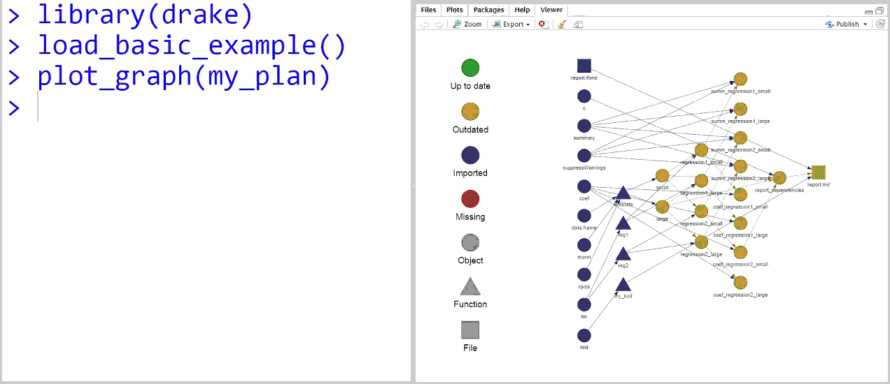

<h1 align="center">
  
</h1>

[](https://travis-ci.org/wlandau-lilly/drake)
[](https://ci.appveyor.com/project/wlandau-lilly/drake)
[](https://codecov.io/github/wlandau-lilly/drake?branch=master)
[](http://cran.r-project.org/package=drake)
[](https://www.gnu.org/licenses/gpl-3.0.en.html)
[](https://cran.r-project.org/)



# drake - data frames in R for [Make](http://kbroman.org/minimal_make/)

Drake is a workflow manager and build system for

1. [Reproducibility](#rpd).
2. [High-performance computing](#hpc).

# Installation

```r
install.packages("drake") # latest CRAN version
devtools::install_github("wlandau-lilly/drake@v3.1.0", build = TRUE) # latest GitHub release
devtools::install_github("wlandau-lilly/drake", build = TRUE) # development version
```

For `make(..., parallelism = "Makefile")`, Windows users need to download and install [`Rtools`](https://cran.r-project.org/bin/windows/Rtools/).

# Quickstart

```{r}
library(drake)
load_basic_example() # into your workspace.
plot_graph(my_plan) # Graph the workflow.
make(my_plan) # Run the workflow.
make(my_plan) # Check that everything is already up to date.
```

Dive deeper into the built-in examples.

```r
example_drake("basic") # Write the code files.
examples_drake() # List the other examples.
```

# Documentation

The [CRAN page](https://CRAN.R-project.org/package=drake) links to multiple rendered vignettes.

```r
vignette(package = "drake") # List the vignettes.
vignette("drake") # High-level intro.
vignette("quickstart") # Walk through a simple example.
vignette("caution") # Avoid common pitfalls.
```

# Help and troubleshooting

Please refer to [TROUBLESHOOTING.md](https://github.com/wlandau-lilly/drake/blob/master/TROUBLESHOOTING.md) on the [GitHub page](https://github.com/wlandau-lilly/drake) for instructions.

# Reproducibility {#rpd}

There is room to improve the conversation and the landscape of reproducibility in the R and Statistics communities. At a more basic level than scientific replicability, literate programming, and version control, reproducibility carries an implicit promise that the alleged results of an analysis really do match the code. Drake helps keep this promise by tracking the relationships among the components of the analysis, a rare and effective approach that also saves time. 

```r
library(drake)
load_basic_example()
make(my_plan) # Build everything.
make(my_plan) # Nothing is done because everything is already up to date.
reg2 = function(d){ # Change one of your functions.
  d$x3 = d$x^3
  lm(y ~ x3, data = d)
}
make(my_plan) # Only the pieces depending on reg2() get rebuilt.
```

# High-performance computing {#hpc}

Similarly to [Make](https://www.gnu.org/software/make/), drake arranges the intermediate steps of your workflow in a network (see `plot_graph()`). That way,  you can run independent steps in parallel. Choose from multiple built-in backends.

1. **mclapply**: `drake::make(..., parallelism = "mclapply", jobs = 2)` invokes `parallel::mclapply()` under the hood, distributing the work over at most two independent processes (set with `jobs`). Mclapply is an ideal choice for low-overhead single-node parallelism, but it does not work on Windows.
2. **parLapply**: `drake::make(..., parallelism = "parLapply", jobs = 2)` invokes `parallel::mclapply()` under the hood. This option is similar to mclapply except that it works on Windows and costs a little extra time up front.
3. **Makefile**:
- `drake::make(..., parallelism = "Makefile", jobs = 2)` creates a proper [Makefile](https://www.gnu.org/software/make/) to distribute the work over multiple independent R sessions.
- `drake::make(..., parallelism = "Makefile", jobs = 2, prepend = "SHELL=./shell.sh")` is similar, but it uses a helper file `shell.sh` to distribute the R sessions over different jobs on a cluster. Here, you can make use of true distributed computing on a supercomputer. Your `shell.sh` file should look like this.

```r
#!/bin/bash
shift
echo "module load R; $*" | qsub -sync y -cwd -j y
```

[SLURM](https://slurm.schedmd.com/) users can dispense with `shell.sh` entirely and just set `prepend = "srun"` in `make()`.


# Standing on the shoulders of giants

The original idea of a time-saving reproducible build system extends back decades to [GNU Make](http://kbroman.org/minimal_make/), which today helps [data scientists](http://blog.kaggle.com/2012/10/15/make-for-data-scientists/) as well as the original user base of complied-language programmers. More recently, [Rich FitzJohn](http://richfitz.github.io/) created [remake](https://github.com/richfitz/remake), a breakthrough reimagining of [Make](http://kbroman.org/minimal_make/) for R and the most important inspiration for drake. Drake is a fresh reinterpretation of some of  [remake](https://github.com/richfitz/remake)'s pioneering fundamental concepts, scaled up for computationally-demanding workflows. 

Thanks also to [Kirill M&uuml;ller](http://krlmlr.github.io/) and [Daniel Falster](http://danielfalster.com/). They contributed code patches and enhancement ideas to my [parallelRemake](https://github.com/wlandau/parallelRemake) and [remakeGenerator](https://github.com/wlandau/remakeGenerator) packages, which I have now subsumed into drake.

In the sphere of reproducibility, drake and [remake](https://github.com/richfitz/remake) are examples of non-literate programming tools (as opposed to literate programming tools such as [knitr](https://CRAN.R-project.org/package=knitr)). Counterparts include [R.cache](https://CRAN.R-project.org/package=R.cache), [archivist](https://CRAN.R-project.org/package=archivist), [trackr](https://github.com/gmbecker/recordr), and [memoise](https://CRAN.R-project.org/package=memoise). See the [reporducible research CRAN task view](https://CRAN.R-project.org/view=ReproducibleResearch) for a more comprehensive list. Drake differentiates itself from these tools with its ability to track the relationships among cached objects and its extensive high-performance computing functionality.
