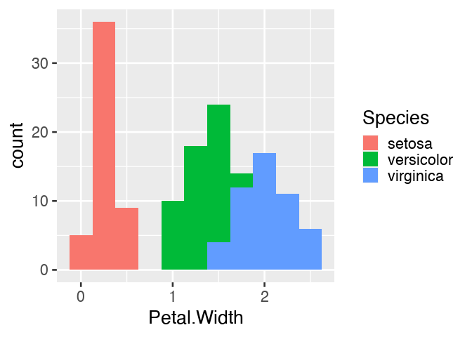
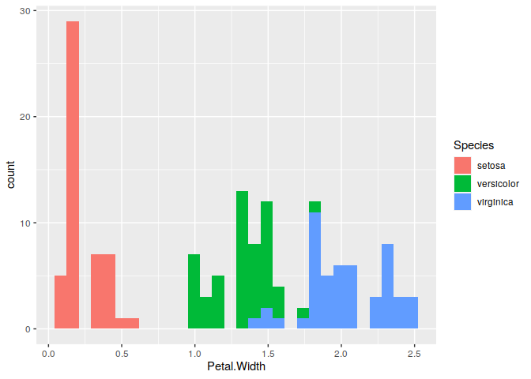

<!-- README.md is generated from README.Rmd. Please edit that file -->

<center>

</center>
<table class="table">
<thead>
<tr class="header">
<th align="left">
Usage
</th>
<th align="left">
Release
</th>
<th align="left">
Development
</th>
</tr>
</thead>
<tbody>
<tr class="odd">
<td align="left">
<a href="https://www.gnu.org/licenses/gpl-3.0.en.html"></a>
</td>
<td align="left">
<a href="https://cran.r-project.org/package=drake"></a>
</td>
<td align="left">
<a href="https://github.com/ropensci/drake/actions?query=workflow%3Acheck"></a>
</td>
</tr>
<tr class="even">
<td align="left">
<a href="https://cran.r-project.org/"></a>
</td>
<td align="left">
<a href="https://cran.r-project.org/web/checks/check_results_drake.html"></a>
</td>
<td align="left">
<a href="https://github.com/ropensci/drake/actions?query=workflow%3Alint"></a>
</td>
</tr>
<tr class="odd">
<td align="left">
<a href="https://CRAN.R-project.org/package=drake"></a>
</td>
<td align="left">
<a href="https://github.com/ropensci/onboarding/issues/156"></a>
</td>
<td align="left">
<a href="https://codecov.io/github/ropensci/drake?branch=master"></a>
</td>
</tr>
<tr class="even">
<td align="left">
<a href="https://CRAN.R-project.org/package=drake"></a>
</td>
<td align="left">
<a href="https://doi.org/10.21105/joss.00550"></a>
</td>
<td align="left">
<a href="https://bestpractices.coreinfrastructure.org/projects/2135"></a>
</td>
</tr>
<tr class="odd">
<td align="left">
<a href="https://saythanks.io/to/drake-r-package-feedback"></a>
</td>
<td align="left">
<a href="https://zenodo.org/badge/latestdoi/82609103"></a>
</td>
<td align="left">
<a href="https://www.repostatus.org/#active"></a>
</td>
</tr>
</tbody>
</table>
<br>

# The drake R package 

Data analysis can be slow. A round of scientific computation can take
several minutes, hours, or even days to complete. After it finishes, if
you update your code or data, your hard-earned results may no longer be
valid. How much of that valuable output can you keep, and how much do
you need to update? How much runtime must you endure all over again?

For projects in R, the `drake` package can help. It [analyzes your
workflow](https://books.ropensci.org/drake/plans.html), skips steps with
up-to-date results, and orchestrates the rest with [optional distributed
computing](https://books.ropensci.org/drake/hpc.html). At the end,
`drake` provides evidence that your results match the underlying code
and data, which increases your ability to trust your research.

# Video

## That Feeling of Workflowing

<center>
<a href="https://www.youtube.com/embed/jU1Zv21GvT4">

</a>
</center>

(By [Miles McBain](https://github.com/MilesMcBain); [venue](https://nyhackr.org/index.html),
[resources](https://github.com/MilesMcBain/nycr_meetup_talk))

## rOpenSci Community Call

<center>

<a href="https://ropensci.org/commcalls/2019-09-24/">

</a>

</center>

([resources](https://ropensci.org/commcalls/2019-09-24/))

# What gets done stays done.

Too many data science projects follow a [Sisyphean
loop](https://en.wikipedia.org/wiki/Sisyphus):

1.  Launch the code.
2.  Wait while it runs.
3.  Discover an issue.
4.  Rerun from scratch.

For projects with long runtimes, this process gets tedious. But with
`drake`, you can automatically

1.  Launch the parts that changed since last time.
2.  Skip the rest.

# How it works

To set up a project, load your packages,

``` r
library(drake)
library(dplyr)
library(ggplot2)
library(tidyr)
#> 
#> Attaching package: 'tidyr'
#> The following objects are masked from 'package:drake':
#> 
#>     expand, gather
```

load your custom functions,

``` r
create_plot <- function(data) {
  ggplot(data) +
    geom_histogram(aes(x = Ozone)) +
    theme_gray(24)
}
```

check any supporting files (optional),

``` r
# Get the files with drake_example("main").
file.exists("raw_data.xlsx")
#> [1] TRUE
file.exists("report.Rmd")
#> [1] TRUE
```

and plan what you are going to do.

``` r
plan <- drake_plan(
  raw_data = readxl::read_excel(file_in("raw_data.xlsx")),
  data = raw_data %>%
    mutate(Ozone = replace_na(Ozone, mean(Ozone, na.rm = TRUE))),
  hist = create_plot(data),
  fit = lm(Ozone ~ Wind + Temp, data),
  report = rmarkdown::render(
    knitr_in("report.Rmd"),
    output_file = file_out("report.html"),
    quiet = TRUE
  )
)

plan
#> # A tibble: 5 x 2
#>   target   command                                                              
#>   <chr>    <expr_lst>                                                           
#> 1 raw_data readxl::read_excel(file_in("raw_data.xlsx"))                        …
#> 2 data     raw_data %>% mutate(Ozone = replace_na(Ozone, mean(Ozone, na.rm = TR…
#> 3 hist     create_plot(data)                                                   …
#> 4 fit      lm(Ozone ~ Wind + Temp, data)                                       …
#> 5 report   rmarkdown::render(knitr_in("report.Rmd"), output_file = file_out("re…
```

So far, we have just been setting the stage. Use `make()` or
[`r_make()`](https://books.ropensci.org/drake/projects.html#safer-interactivity)
to do the real work. Targets are built in the correct order regardless
of the row order of `plan`.

``` r
make(plan) # See also r_make().
#> ▶ target raw_data
#> ▶ target data
#> ▶ target fit
#> ▶ target hist
#> ▶ target report
```

Except for files like `report.html`, your output is stored in a hidden
`.drake/` folder. Reading it back is easy.

``` r
readd(data) # See also loadd().
#> # A tibble: 153 x 6
#>    Ozone Solar.R  Wind  Temp Month   Day
#>    <dbl>   <dbl> <dbl> <dbl> <dbl> <dbl>
#>  1  41       190   7.4    67     5     1
#>  2  36       118   8      72     5     2
#>  3  12       149  12.6    74     5     3
#>  4  18       313  11.5    62     5     4
#>  5  42.1      NA  14.3    56     5     5
#>  6  28        NA  14.9    66     5     6
#>  7  23       299   8.6    65     5     7
#>  8  19        99  13.8    59     5     8
#>  9   8        19  20.1    61     5     9
#> 10  42.1     194   8.6    69     5    10
#> # … with 143 more rows
```

You may look back on your work and see room for improvement, but it’s
all good\! The whole point of `drake` is to help you go back and change
things quickly and painlessly. For example, we forgot to give our
histogram a bin width.

``` r
readd(hist)
#> `stat_bin()` using `bins = 30`. Pick better value with `binwidth`.
```

<!-- -->

So let’s fix the plotting function.

``` r
create_plot <- function(data) {
  ggplot(data) +
    geom_histogram(aes(x = Ozone), binwidth = 10) +
    theme_gray(24)
}
```

`drake` knows which results are
affected.

``` r
vis_drake_graph(plan) # See also r_vis_drake_graph().
```


The next `make()` just builds `hist` and `report.html`. No point in
wasting time on the data or model.

``` r
make(plan) # See also r_make().
#> ▶ target hist
#> ▶ target report
```

``` r
loadd(hist)
hist
```

<!-- -->

# Reproducibility with confidence

The R community emphasizes reproducibility. Traditional themes include
[scientific
replicability](https://en.wikipedia.org/wiki/Replication_crisis),
literate programming with [knitr](https://yihui.name/knitr/), and
version control with
[git](https://git-scm.com/book/en/v2/Getting-Started-About-Version-Control).
But internal consistency is important too. Reproducibility carries the
promise that your output matches the code and data you say you used.
With the exception of [non-default
triggers](https://books.ropensci.org/drake/triggers.html) and [hasty
mode](https://books.ropensci.org/drake/hpc.html#hasty-mode), `drake`
strives to keep this promise.

## Evidence

Suppose you are reviewing someone else’s data analysis project for
reproducibility. You scrutinize it carefully, checking that the datasets
are available and the documentation is thorough. But could you re-create
the results without the help of the original author? With `drake`, it is
quick and easy to find out.

``` r
make(plan) # See also r_make().
#> ℹ unloading 1 targets from environment
#> ✓ All targets are already up to date.

outdated(plan) # See also r_outdated().
#> character(0)
```

With everything already up to date, you have **tangible evidence** of
reproducibility. Even though you did not re-create the results, you know
the results are recreatable. They **faithfully show** what the code is
producing. Given the right [package
environment](https://rstudio.github.io/packrat/) and [system
configuration](https://stat.ethz.ch/R-manual/R-devel/library/utils/html/sessionInfo.html),
you have everything you need to reproduce all the output by yourself.

## Ease

When it comes time to actually rerun the entire project, you have much
more confidence. Starting over from scratch is trivially easy.

``` r
clean()    # Remove the original author's results.
make(plan) # Independently re-create the results from the code and input data.
#> ▶ target raw_data
#> ▶ target data
#> ▶ target fit
#> ▶ target hist
#> ▶ target report
```

## Big data efficiency

Select specialized data formats to increase speed and reduce memory
consumption. In version 7.5.2.9000 and above, the available formats are
[“fst”](https://github.com/fstpackage/fst) for data frames (example
below) and “keras” for [Keras](https://keras.rstudio.com/) models
([example here](https://books.ropensci.org/drake/churn.html#plan)).

``` r
library(drake)
n <- 1e8 # Each target is 1.6 GB in memory.
plan <- drake_plan(
  data_fst = target(
    data.frame(x = runif(n), y = runif(n)),
    format = "fst"
  ),
  data_old = data.frame(x = runif(n), y = runif(n))
)
make(plan)
#> target data_fst
#> target data_old
build_times(type = "build")
#> # A tibble: 2 x 4
#>   target   elapsed              user                 system    
#>   <chr>    <Duration>           <Duration>           <Duration>
#> 1 data_fst 13.93s               37.562s              7.954s    
#> 2 data_old 184s (~3.07 minutes) 177s (~2.95 minutes) 4.157s
```

## History and provenance

As of version 7.5.2, `drake` tracks the history and provenance of your
targets: what you built, when you built it, how you built it, the
arguments you used in your function calls, and how to get the data back.
(Disable with `make(history = FALSE)`)

``` r
history <- drake_history(analyze = TRUE)
history
#> # A tibble: 12 x 11
#>    target current built exists hash  command   seed runtime na.rm quiet
#>    <chr>  <lgl>   <chr> <lgl>  <chr> <chr>    <int>   <dbl> <lgl> <lgl>
#>  1 data   TRUE    2020… TRUE   11e2… "raw_d… 1.29e9 0.013   TRUE  NA   
#>  2 data   TRUE    2020… TRUE   11e2… "raw_d… 1.29e9 0.004   TRUE  NA   
#>  3 fit    TRUE    2020… TRUE   3c87… "lm(Oz… 1.11e9 0.004   NA    NA   
#>  4 fit    TRUE    2020… TRUE   3c87… "lm(Oz… 1.11e9 0.00200 NA    NA   
#>  5 hist   FALSE   2020… TRUE   88ae… "creat… 2.10e8 0.0120  NA    NA   
#>  6 hist   TRUE    2020… TRUE   0304… "creat… 2.10e8 0.005   NA    NA   
#>  7 hist   TRUE    2020… TRUE   0304… "creat… 2.10e8 0.007   NA    NA   
#>  8 raw_d… TRUE    2020… TRUE   855d… "readx… 1.20e9 0.016   NA    NA   
#>  9 raw_d… TRUE    2020… TRUE   855d… "readx… 1.20e9 0.013   NA    NA   
#> 10 report TRUE    2020… TRUE   d78a… "rmark… 1.30e9 0.628   NA    TRUE 
#> 11 report TRUE    2020… TRUE   d78a… "rmark… 1.30e9 0.406   NA    TRUE 
#> 12 report TRUE    2020… TRUE   d78a… "rmark… 1.30e9 0.375   NA    TRUE 
#> # … with 1 more variable: output_file <chr>
```

Remarks:

  - The `quiet` column appears above because one of the `drake_plan()`
    commands has `knit(quiet = TRUE)`.
  - The `hash` column identifies all the previous versions of your
    targets. As long as `exists` is `TRUE`, you can recover old data.
  - Advanced: if you use `make(cache_log_file = TRUE)` and put the cache
    log file under version control, you can match the hashes from
    `drake_history()` with the `git` commit history of your code.

Let’s use the history to recover the oldest histogram.

``` r
hash <- history %>%
  filter(target == "hist") %>%
  pull(hash) %>%
  head(n = 1)
cache <- drake_cache()
cache$get_value(hash)
#> `stat_bin()` using `bins = 30`. Pick better value with `binwidth`.
```

<!-- -->

## Independent replication

With even more evidence and confidence, you can invest the time to
independently replicate the original code base if necessary. Up until
this point, you relied on basic `drake` functions such as `make()`, so
you may not have needed to peek at any substantive author-defined code
in advance. In that case, you can stay usefully ignorant as you
reimplement the original author’s methodology. In other words, `drake`
could potentially improve the integrity of independent replication.

## Readability and transparency

Ideally, independent observers should be able to read your code and
understand it. `drake` helps in several ways.

  - The [drake
    plan](https://docs.ropensci.org/drake/reference/drake_plan.html)
    explicitly outlines the steps of the analysis, and
    [`vis_drake_graph()`](https://docs.ropensci.org/drake/reference/vis_drake_graph.html)
    visualizes how those steps depend on each other.
  - `drake` takes care of the parallel scheduling and high-performance
    computing (HPC) for you. That means the HPC code is no longer
    tangled up with the code that actually expresses your ideas.
  - You can [generate large collections of
    targets](https://books.ropensci.org/drake/gsp.html) without
    necessarily changing your code base of imported functions, another
    nice separation between the concepts and the execution of your
    workflow

# Scale up and out.

Not every project can complete in a single R session on your laptop.
Some projects need more speed or computing power. Some require a few
local processor cores, and some need large high-performance computing
systems. But parallel computing is hard. Your tables and figures depend
on your analysis results, and your analyses depend on your datasets, so
some tasks must finish before others even begin. `drake` knows what to
do. Parallelism is implicit and automatic. See the [high-performance
computing guide](https://books.ropensci.org/drake/hpc.html) for all the
details.

``` r
# Use the spare cores on your local machine.
make(plan, jobs = 4)

# Or scale up to a supercomputer.
drake_hpc_template_file("slurm_clustermq.tmpl") # https://slurm.schedmd.com/
options(
  clustermq.scheduler = "clustermq",
  clustermq.template = "slurm_clustermq.tmpl"
)
make(plan, parallelism = "clustermq", jobs = 4)
```

# With Docker

`drake` and Docker are compatible and complementary. Here are some
examples that run `drake` inside a Docker
    image.

  - [`drake-gitlab-docker-example`](https://gitlab.com/ecohealthalliance/drake-gitlab-docker-example):
    A small pedagogical example workflow that leverages `drake`, Docker,
    GitLab, and continuous integration in a reproducible analysis
    pipeline. Created by [Noam Ross](https://www.noamross.net/).
  - [`pleurosoriopsis`](https://github.com/joelnitta/pleurosoriopsis):
    The workflow that supports [Ebihara *et al.* 2019. “Growth Dynamics
    of the Independent Gametophytes of *Pleurorosiopsis makinoi*
    (Polypodiaceae)” *Bulletin of the National Science Museum Series B
    (Botany)*
    45:77-86.](https://www.kahaku.go.jp/research/publication/botany.html).
    Created by [Joel Nitta](https://github.com/joelnitta).

Alternatively, it is possible to run `drake` outside Docker and use the
[`future`](https://github.com/HenrikBengtsson/future) package to send
targets to a Docker image. `drake`’s
[`Docker-psock`](https://github.com/wlandau/drake-examples/tree/master/Docker-psock)
example demonstrates how. Download the code with
`drake_example("Docker-psock")`.

# Installation

You can choose among different versions of `drake`. The CRAN release
often lags behind the [online manual](https://books.ropensci.org/drake/)
but may have fewer bugs.

``` r
# Install the latest stable release from CRAN.
install.packages("drake")

# Alternatively, install the development version from GitHub.
install.packages("devtools")
library(devtools)
install_github("ropensci/drake")
```

# Function reference

The [reference
section](https://docs.ropensci.org/drake/reference/index.html) lists all
the available functions. Here are the most important ones.

  - `drake_plan()`: create a workflow data frame (like `my_plan`).
  - `make()`: build your project.
  - `drake_history()`: show what you built, when you built it, and the
    function arguments you used.
  - `r_make()`: launch a fresh
    [`callr::r()`](https://github.com/r-lib/callr) process to build your
    project. Called from an interactive R session, `r_make()` is more
    reproducible than `make()`.
  - `loadd()`: load one or more built targets into your R session.
  - `readd()`: read and return a built target.
  - `vis_drake_graph()`: show an interactive visual network
    representation of your workflow.
  - `recoverable()`: Which targets can we salvage using `make(recover =
    TRUE)` (experimental).
  - `outdated()`: see which targets will be built in the next `make()`.
  - `deps_code()`: check the dependencies of a command or function.
  - `drake_failed()`: list the targets that failed to build in the last
    `make()`.
  - `diagnose()`: return the full context of a build, including errors,
    warnings, and messages.

# Documentation

## Core concepts

The following resources explain what `drake` can do and how it works.
The [`learndrake`](https://github.com/wlandau/learndrake) workshop
devotes particular attention to `drake`’s mental model.

  - The [user manual](https://books.ropensci.org/drake/)
  - [`drakeplanner`](https://github.com/wlandau/drakeplanner), an
    R/Shiny app to help learn `drake` and create new projects. Run
    locally with `drakeplanner::drakeplanner()` or access it at
    <https://wlandau.shinyapps.io/drakeplanner>.
  - [`learndrake`](https://github.com/wlandau/learndrake), an R package
    for teaching an extended `drake` workshop. It contains notebooks,
    slides, Shiny apps, the latter two of which are publicly deployed.
    See the
    [README](https://github.com/wlandau/learndrake/blob/master/README.md)
    for instructions and links.

## In practice

  - [Miles McBain](https://github.com/MilesMcBain)’s [excellent blog
    post](https://milesmcbain.xyz/the-drake-post/) explains the
    motivating factors and practical issues {drake} solves for most
    projects, how to set up a project as quickly and painlessly as
    possible, and how to overcome common obstacles.
  - Miles’ [`dflow`](https://github.com/MilesMcBain/dflow) package
    generates the file structure for a boilerplate `drake` project. It
    is a more thorough alternative to `drake::use_drake()`.
  - `drake` is heavily function-oriented by design, and Miles’
    [`fnmate`](https://github.com/MilesMcBain/fnmate) package
    automatically generates boilerplate code and docstrings for
    functions you mention in `drake` plans.

## Reference

  - The [reference website](https://docs.ropensci.org/drake/).
  - The [official repository of example
    code](https://github.com/wlandau/drake-examples). Download an
    example workflow from here with `drake_example()`.
  - Presentations and workshops by [Will
    Landau](https://github.com/wlandau), [Kirill
    Müller](https://github.com/krlmlr), [Amanda
    Dobbyn](https://github.com/aedobbyn), [Karthik
    Ram](http://github.com/karthik), [Sina
    Rüeger](https://github.com/sinarueeger), [Christine
    Stawitz](https://github.com/cstawitz), and others. See specific
    links at <https://books.ropensci.org/drake/index.html#presentations>
  - The [FAQ page](https://books.ropensci.org/drake/faq.html), which
    links to [appropriately-labeled issues on
    GitHub](https://github.com/ropensci/drake/issues?utf8=%E2%9C%93&q=is%3Aissue+label%3A%22frequently+asked+question%22+).

## Use cases

The official [rOpenSci use
cases](https://discuss.ropensci.org/c/usecases) and [associated
discussion threads](https://discuss.ropensci.org/c/usecases) describe
applications of `drake` in the real world. Many of these use cases are
linked from the [`drake` tag on the rOpenSci discussion
forum](https://discuss.ropensci.org/tag/drake).

Here are some additional applications of `drake` in real-world
    projects.

  - [efcaguab/demografia-del-voto](https://github.com/efcaguab/demografia-del-voto)
  - [efcaguab/great-white-shark-nsw](https://github.com/efcaguab/great-white-shark-nsw)
  - [IndianaCHE/Detailed-SSP-Reports](https://github.com/IndianaCHE/Detailed-SSP-Reports)
  - [joelnitta/pleurosoriopsis](https://github.com/joelnitta/pleurosoriopsis)
  - [pat-s/pathogen-modeling](https://github.com/pat-s/pathogen-modeling)
  - [sol-eng/tensorflow-w-r](https://github.com/sol-eng/tensorflow-w-r)
  - [tiernanmartin/home-and-hope](https://github.com/tiernanmartin/home-and-hope)

## `drake` projects as R packages

Some folks like to structure their `drake` workflows as R packages.
Examples are below. In your own analysis packages, be sure to call
`drake::expose_imports(yourPackage)` so `drake` can watch you package’s
functions for changes and rebuild downstream targets
    accordingly.

  - [b-rodrigues/coolmlproject](https://github.com/b-rodrigues/coolmlproject)
  - [tiernanmartin/drakepkg](https://github.com/tiernanmartin/drakepkg)

# Help and troubleshooting

The following resources document many known issues and challenges.

  - [Frequently-asked
    questions](https://github.com/ropensci/drake/issues?utf8=%E2%9C%93&q=is%3Aissue+label%3A%22type:+faq%22+).
  - [Debugging and testing drake
    projects](https://books.ropensci.org/drake/debugging.html)
  - [Other known issues](https://github.com/ropensci/drake/issues)
    (please search both open and closed ones).

If you are still having trouble, please submit a [new
issue](https://github.com/ropensci/drake/issues/new) with a bug report
or feature request, along with a minimal reproducible example where
appropriate.

The GitHub issue tracker is mainly intended for bug reports and feature
requests. While questions about usage etc. are also highly encouraged,
you may alternatively wish to post to [Stack
Overflow](https://stackoverflow.com) and use the [`drake-r-package`
tag](https://stackoverflow.com/tags/drake-r-package).

# Contributing

Development is a community effort, and we encourage participation.
Please read
[CONTRIBUTING.md](https://github.com/ropensci/drake/blob/master/CONTRIBUTING.md)
for details.

# Similar work

`drake` enhances reproducibility and high-performance computing, but not
in all respects. [Literate programming](https://rmarkdown.rstudio.com/),
[local library managers](https://rstudio.github.io/packrat),
[containerization](https://www.docker.com/), and [strict session
managers](https://github.com/tidyverse/reprex) offer more robust
solutions in their respective domains. And for the problems `drake`
*does* solve, it stands on the shoulders of the giants that came before.

## Pipeline tools

### GNU Make

The original idea of a time-saving reproducible build system extends
back at least as far as [GNU Make](https://www.gnu.org/software/make/),
which still aids the work of [data
scientists](http://blog.kaggle.com/2012/10/15/make-for-data-scientists/)
as well as the original user base of complied language programmers. In
fact, the name “drake” stands for “Data Frames in R for Make”.
[Make](https://kbroman.org/minimal_make/) is used widely in reproducible
research. Below are some examples from [Karl Broman’s
website](https://kbroman.org/minimal_make/).

  - Bostock, Mike (2013). “A map of flowlines from NHDPlus.”
    <https://github.com/mbostock/us-rivers>. Powered by the Makefile at
    <https://github.com/mbostock/us-rivers/blob/master/Makefile>.
  - Broman, Karl W (2012). “Halotype Probabilities in Advanced
    Intercross Populations.” *G3* 2(2), 199-202.Powered by the
    `Makefile` at
    <https://github.com/kbroman/ailProbPaper/blob/master/Makefile>.
  - Broman, Karl W (2012). “Genotype Probabilities at Intermediate
    Generations in the Construction of Recombinant Inbred Lines.”
    \*Genetics 190(2), 403-412. Powered by the Makefile at
    <https://github.com/kbroman/preCCProbPaper/blob/master/Makefile>.
  - Broman, Karl W and Kim, Sungjin and Sen, Saunak and Ane, Cecile and
    Payseur, Bret A (2012). “Mapping Quantitative Trait Loci onto a
    Phylogenetic Tree.” *Genetics* 192(2), 267-279. Powered by the
    `Makefile` at
    <https://github.com/kbroman/phyloQTLpaper/blob/master/Makefile>.

Whereas [GNU Make](https://www.gnu.org/software/make/) is
language-agnostic, `drake` is fundamentally designed for R.

  - Instead of a
    [Makefile](https://github.com/kbroman/preCCProbPaper/blob/master/Makefile),
    `drake` supports an R-friendly [domain-specific
    language](https://books.ropensci.org/drake/plans.html#large-plans)
    for declaring targets.
  - Targets in [GNU Make](https://www.gnu.org/software/make/) are files,
    whereas targets in `drake` are arbitrary variables in memory.
    (`drake` does have opt-in support for files via `file_out()`,
    `file_in()`, and `knitr_in()`.) `drake` caches these objects in its
    own [storage system](https://github.com/richfitz/storr) so R users
    rarely have to think about output files.

### Remake

[remake](https://github.com/richfitz/remake) itself is no longer
maintained, but its founding design goals and principles live on through
[drake](https://github.com/ropensci/drake). In fact,
[drake](https://github.com/ropensci/drake) is a direct re-imagining of
[remake](https://github.com/richfitz/remake) with enhanced scalability,
reproducibility, high-performance computing, visualization, and
documentation.

### Factual’s Drake

[Factual’s Drake](https://github.com/Factual/drake) is similar in
concept, but the development effort is completely unrelated to the
[drake R package](https://github.com/ropensci/drake).

### Other pipeline tools

There are [countless other successful pipeline
toolkits](https://github.com/pditommaso/awesome-pipeline). The `drake`
package distinguishes itself with its R-focused approach,
Tidyverse-friendly interface, and a [thorough selection of parallel
computing technologies and scheduling
algorithms](https://books.ropensci.org/drake/hpc.html).

## Memoization

Memoization is the strategic caching of the return values of functions.
It is a lightweight approach to the core problem that `drake` and other
pipeline tools are trying to solve. Every time a memoized function is
called with a new set of arguments, the return value is saved for future
use. Later, whenever the same function is called with the same
arguments, the previous return value is salvaged, and the function call
is skipped to save time. The
[`memoise`](https://github.com/r-lib/memoise) package is the primary
implementation of memoization in R.

Memoization saves time for small projects, but it arguably does not go
far enough for large reproducible pipelines. In reality, the return
value of a function depends not only on the function body and the
arguments, but also on any nested functions and global variables, the
dependencies of those dependencies, and so on upstream. `drake` tracks
this deeper context, while [memoise](https://github.com/r-lib/memoise)
does not.

## Literate programming

[Literate programming](https://rmarkdown.rstudio.com/) is the practice
of narrating code in plain vernacular. The goal is to communicate the
research process clearly, transparently, and reproducibly. Whereas
commented code is still mostly code, literate
[knitr](https://yihui.name/knitr/) / [R
Markdown](https://rmarkdown.rstudio.com/) reports can become websites,
presentation slides, lecture notes, serious scientific manuscripts, and
even books.

### knitr and R Markdown

`drake` and [knitr](https://yihui.name/knitr/) are symbiotic. `drake`’s
job is to manage large computation and orchestrate the demanding tasks
of a complex data analysis pipeline.
[knitr](https://yihui.name/knitr/)’s job is to communicate those
expensive results after `drake` computes them.
[knitr](https://yihui.name/knitr/) / [R
Markdown](https://rmarkdown.rstudio.com/) reports are small pieces of an
overarching `drake` pipeline. They should focus on communication, and
they should do as little computation as possible.

To insert a [knitr](https://yihui.name/knitr/) report in a `drake`
pipeline, use the `knitr_in()` function inside your [`drake`
plan](https://books.ropensci.org/drake/plans.html), and use `loadd()`
and `readd()` to refer to targets in the report itself. See an [example
here](https://github.com/wlandau/drake-examples/tree/master/main).

### Version control

`drake` is not a version control tool. However, it is fully compatible
with [`git`](https://git-scm.com/),
[`svn`](https://en.wikipedia.org/wiki/Apache_Subversion), and similar
software. In fact, it is good practice to use
[`git`](https://git-scm.com/) alongside `drake` for reproducible
workflows.

However, data poses a challenge. The datasets created by `make()` can
get large and numerous, and it is not recommended to put the `.drake/`
cache or the `.drake_history/` logs under version control. Instead, it
is recommended to use a data storage solution such as
[DropBox](https://www.dropbox.com/) or
[OSF](https://osf.io/ka7jv/wiki/home/).

### Containerization and R package environments

`drake` does not track R packages or system dependencies for changes.
Instead, it defers to tools like [Docker](https://www.docker.com),
[Singularity](https://sylabs.io/singularity/),
[`renv`](https://github.com/rstudio/renv), and
[`packrat`](https://github.com/rstudio/packrat), which create
self-contained portable environments to reproducibly isolate and ship
data analysis projects. `drake` is fully compatible with these tools.

### workflowr

The [`workflowr`](https://github.com/jdblischak/workflowr) package is a
project manager that focuses on literate programming, sharing over the
web, file organization, and version control. Its brand of
reproducibility is all about transparency, communication, and
discoverability. For an example of
[`workflowr`](https://github.com/jdblischak/workflowr) and `drake`
working together, see [this machine learning
project](https://github.com/pat-s/2019-feature-selection) by [Patrick
Schratz](https://github.com/pat-s).

# Acknowledgements

Special thanks to [Jarad Niemi](https://www.jarad.me/), my advisor from
[graduate school](https://stat.iastate.edu/), for first introducing me
to the idea of [Makefiles](https://www.gnu.org/software/make/) for
research. He originally set me down the path that led to `drake`.

Many thanks to [Julia Lowndes](https://github.com/jules32), [Ben
Marwick](https://github.com/benmarwick), and [Peter
Slaughter](https://github.com/gothub) for [reviewing drake for
rOpenSci](https://github.com/ropensci/onboarding/issues/156), and to
[Maëlle Salmon](https://github.com/maelle) for such active involvement
as the editor. Thanks also to the following people for contributing
early in development.

  - [Alex Axthelm](https://github.com/AlexAxthelm)
  - [Chan-Yub Park](https://github.com/mrchypark)
  - [Daniel Falster](https://github.com/dfalster)
  - [Eric Nantz](https://github.com/rpodcast)
  - [Henrik Bengtsson](https://github.com/HenrikBengtsson)
  - [Ian Watson](https://github.com/IanAWatson)
  - [Jasper Clarkberg](https://github.com/dapperjapper)
  - [Kendon Bell](https://github.com/kendonB)
  - [Kirill Müller](https://github.com/krlmlr)
  - [Michael Schubert](https://github.com/mschubert)

Credit for images is [attributed
here](https://github.com/ropensci/drake/blob/master/man/figures/image-credit.md).

[](https://ropensci.org)
