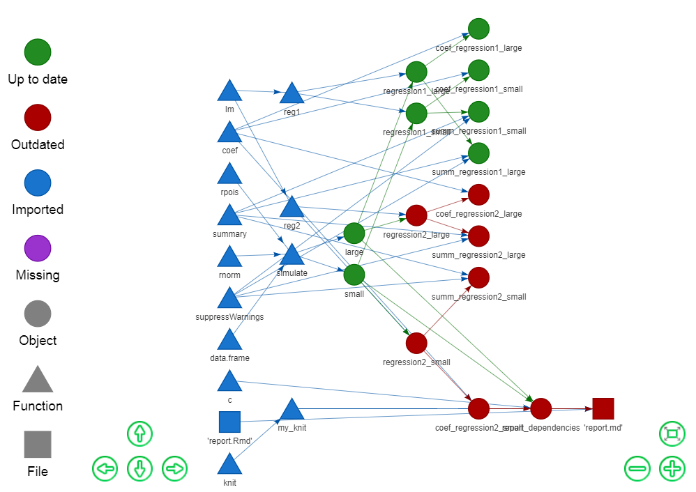

<h1 align="center">
  
</h1>

[](https://travis-ci.org/wlandau-lilly/drake)
[](https://ci.appveyor.com/project/wlandau-lilly/drake)
[](https://codecov.io/github/wlandau-lilly/drake?branch=master)
[](http://cran.r-project.org/package=drake)
[](https://www.gnu.org/licenses/gpl-3.0.en.html)
[](https://cran.r-project.org/)


# drake - data frames in R for [Make](http://kbroman.org/minimal_make/)

Drake is a workflow manager and build system for

1. [Reproducibility](https://CRAN.R-project.org/view=ReproducibleResearch).
2. [High-performance computing](https://CRAN.R-project.org/view=HighPerformanceComputing).

# Installation

```r
install.packages("drake") # latest CRAN release
devtools::install_github("wlandau-lilly/drake@v3.1.0", build = TRUE) # latest GitHub release
devtools::install_github("wlandau-lilly/drake", build = TRUE) # development version
```

# Quickstart

```r
library(drake)
load_basic_example() # into your workspace. Also writes/overwrites file report.Rmd.
plot_graph(my_plan) # Graph the workflow.
outdated(my_plan) # Which targets need to be (re)built?
make(my_plan) # Run the workflow.
outdated(my_plan) # Everything is up to date.
plot_graph(my_plan) # The graph also shows what is up to date.
```

Dive deeper into the built-in examples.

```r
example_drake("basic") # Write the code files.
examples_drake() # List the other examples.
```

# Useful functions

Besides `make()`, here are some useful functions to set up your workflow plan,

```r
plan()
analyses()
summaries()
evaluate()
expand()
gather()
```

explore the dependency network,
```r
outdated()
plot_graph()
read_graph()
deps()
tracked()
```

interact with the cache,
```r
clean()
cached()
imported()
built()
readd()
loadd()
find_project()
find_cache()
```

and debug your work. 
```r
check()
session()
progress()
read_config()
```

# Documentation

The [CRAN page](https://CRAN.R-project.org/package=drake) links to multiple rendered vignettes.

```r
vignette(package = "drake") # List the vignettes.
vignette("drake") # High-level intro.
vignette("quickstart") # Walk through a simple example.
vignette("caution") # Avoid common pitfalls.
```

# Help and troubleshooting

Please refer to [TROUBLESHOOTING.md](https://github.com/wlandau-lilly/drake/blob/master/TROUBLESHOOTING.md) on the [GitHub page](https://github.com/wlandau-lilly/drake) for instructions.

# Reproducibility 

There is room to improve the conversation and the landscape of reproducibility in the R and Statistics communities. At a more basic level than scientific replicability, literate programming, and version control, reproducibility carries an implicit promise that the alleged results of an analysis really do match the code. Drake helps keep this promise by tracking the relationships among the components of the analysis, a rare and effective approach that also saves time. 

```r
library(drake)
load_basic_example()
outdated(my_plan) # Which targets need to be (re)built?
make(my_plan) # Build what needs to be built.
outdated(my_plan) # Everything is up to date.
reg2 = function(d){ # Change one of your functions.
  d$x3 = d$x^3
  lm(y ~ x3, data = d)
}
outdated(my_plan) # Some targets depend on reg2().
plot_graph(my_plan) # See how they fit in an interactive graph.
make(my_plan) # Rebuild just the outdated targets.
outdated(my_plan) # Everything is up to date again.
plot_graph(my_plan) # The colors changed in the graph.
```

# High-performance computing

Similarly to [Make](https://www.gnu.org/software/make/), drake arranges the intermediate steps of your workflow in a dependency web. This network is the key to drake's parallel computing. For example, consider the network graph of the basic example.

```{r basicgraph}
library(drake)
load_basic_example()
plot_graph(my_plan)
```



When you call `make(my_plan, jobs = 4)`, the work proceeds in chronological order from left to right. The items are built or imported column by column in sequence. Within each column, the targets/objects are all independent of each other conditional on the previous steps, so they are distributed over the 4 available parallel workers. As for how the parallelism is implemented, you can choose from multiple built-in backends.

1. **mclapply**: low-overhead, light-weight. `make(..., parallelism = "mclapply", jobs = 2)` invokes `parallel::mclapply()` under the hood and distributes the work over at most two independent processes (set with `jobs`). Mclapply is an ideal choice for low-overhead single-node parallelism, but it does not work on Windows.
2. **parLapply**: medium-overhead, light-weight. `make(..., parallelism = "parLapply", jobs = 2)` invokes `parallel::mclapply()` under the hood. This option is similar to mclapply except that it works on Windows and costs a little extra time up front.
3. **Makefile**: high-overhead, heavy-duty. `make(..., parallelism = "Makefile", jobs = 2)` creates a proper [Makefile](https://www.gnu.org/software/make/) to distribute the work over multiple independent R sessions. With custom settings, you can distribute the R sessions over different jobs/nodes on a cluster. See the [quickstart vignette](https://cran.r-project.org/package=drake/vignettes/quickstart.html) for more details.

# Acknowledgements and related work

The original idea of a time-saving reproducible build system extends back decades to [GNU Make](http://kbroman.org/minimal_make/), which today helps [data scientists](http://blog.kaggle.com/2012/10/15/make-for-data-scientists/) as well as the original user base of complied-language programmers. More recently, [Rich FitzJohn](http://richfitz.github.io/) created [remake](https://github.com/richfitz/remake), a breakthrough reimagining of [Make](http://kbroman.org/minimal_make/) for R and the most important inspiration for drake. Drake is a fresh reinterpretation of some of  [remake](https://github.com/richfitz/remake)'s pioneering fundamental concepts, scaled up for computationally-demanding workflows. 

Thanks also to [Kirill M&uuml;ller](http://krlmlr.github.io/) and [Daniel Falster](http://danielfalster.com/). They contributed code patches and enhancement ideas to my [parallelRemake](https://github.com/wlandau/parallelRemake) and [remakeGenerator](https://github.com/wlandau/remakeGenerator) packages, which I have now subsumed into drake.

In the sphere of reproducibility, drake and [remake](https://github.com/richfitz/remake) are examples of non-literate programming tools (as opposed to literate programming tools such as [knitr](https://CRAN.R-project.org/package=knitr)). Counterparts include [R.cache](https://CRAN.R-project.org/package=R.cache), [archivist](https://CRAN.R-project.org/package=archivist), [trackr](https://github.com/gmbecker/recordr), and [memoise](https://CRAN.R-project.org/package=memoise). See the [reporducible research CRAN task view](https://CRAN.R-project.org/view=ReproducibleResearch) for a more comprehensive list. Drake differentiates itself from these tools with its ability to track the relationships among cached objects and its extensive high-performance computing functionality.
