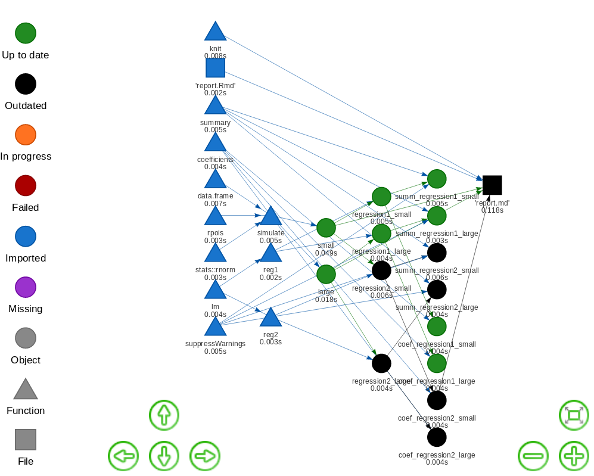

| Release | Usage | Development |
|:--------|:------|:------------|
| [](https://doi.org/10.21105/joss.00550) | [](https://www.gnu.org/licenses/gpl-3.0.en.html) | [](https://ci.appveyor.com/project/ropensci/drake) |
| [](https://github.com/ropensci/onboarding/issues/156) | [](https://cran.r-project.org/) | [](https://travis-ci.org/ropensci/drake) |
| [](http://cran.r-project.org/package=drake) | [](http://cran.rstudio.com/package=drake) | [](https://codecov.io/github/ropensci/drake?branch=master) |
|[](https://zenodo.org/badge/latestdoi/82609103) | |

# The drake R package 

The `drake` R package is a workflow manager and computational engine for data science projects. Its primary objective is to keep results up to date with the underlying code and data. When it runs a project, `drake` detects any pre-existing output and refreshes the pieces that are outdated or missing. Not every runthrough starts from scratch, and the final answers are reproducible. With a user-friendly R-focused interface, [comprehensive documentation](https://ropensci.github.io/drake/), and [extensive implicit parallel computing support](https://github.com/ropensci/drake/blob/master/vignettes/parallelism.Rmd), `drake` surpasses the analogous functionality in similar tools such as  [Make](www.gnu.org/software/make/), [remake](https://github.com/richfitz/remake), [memoise](https://github.com/r-lib/memoise), and [knitr](https://github.com/yihui/knitr).

# What gets done stays done.

Too many data science projects follow a [Sisyphean loop](https://en.wikipedia.org/wiki/Sisyphus):

1. Launch the code.
2. Wait for it to finish.
3. Discover an issue.
4. Restart from scratch.

But `drake` automatically

1. Launches the parts that changed since the last runthrough.
2. Skips the rest.

```r
library(drake)

# Drake comes with a basic example.
# Get the code with drake_example("basic").
load_basic_example(verbose = FALSE)

# Your workspace starts with a bunch of "imports":
# functions, pre-loaded data objects, and saved files
# available before the real work begins.

# Drake looks for data objects in your R session environment
ls()

## [1] "my_plan"  "reg1"     "reg2"     "simulate"

# and saved files in your file system.
list.files()

## [1] "report.Rmd"

# The real work is outlined step by step in the `my_plan` data frame.
# The steps are called "targets", and they depend on the imports.
# Drake's `make()` function runs the commands to build the targets
# in the correct order.
head(my_plan)

##              target                          command
## 1       'report.md' knit('report.Rmd', quiet = TRUE)
## 2             small                      simulate(5)
## 3             large                     simulate(50)
## 4 regression1_small                      reg1(small)
## 5 regression1_large                      reg1(large)
## 6 regression2_small                      reg2(small)

# First round: drake builds all 15 targets.
make(my_plan) 

## target large
## target small
## target regression1_large
## target regression1_small
## target regression2_large
## target regression2_small
## target coef_regression1_large
## target coef_regression1_small
## target coef_regression2_large
## target coef_regression2_small
## target summ_regression1_large
## target summ_regression1_small
## target summ_regression2_large
## target summ_regression2_small
## target 'report.md'

# If you change the reg2() function,
# all the regression2 targets are out of date,
# which in turn affects 'report.md'.
reg2 <- function(d){    
  d$x4 <- d$x ^ 4
  lm(y ~ x4, data = d)
}

# Second round: drake only rebuilds the targets
# that depend on the things you changed.
make(my_plan)

## target regression2_large
## target regression2_small
## target coef_regression2_large
## target coef_regression2_small
## target summ_regression2_large
## target summ_regression2_small
## target 'report.md'

# If nothing important changed, drake rebuilds nothing.
make(my_plan)

## All targets are already up to date.
```

# Reproducibility with confidence

The R community emphasizes reproducibility. Traditional themes include [scientific replicability](https://en.wikipedia.org/wiki/Replication_crisis), literate programming with [knitr](https://yihui.name/knitr/), and version control with [git](https://git-scm.com/book/en/v2/Getting-Started-About-Version-Control). But internal consistency is important too. Reproducibility carries the promise that your output matches the code and data you say you used.

## Evidence

Suppose you are reviewing someone else's data analysis project for reproducibility. You scrutinize it carefully, checking that the datasets are available and the documentation is thorough. But could you re-create the results without the help of the original author? With `drake`, it is quick and easy to find out.

```r
make(my_plan)

## All targets are already up to date.

config <- drake_config(my_plan)
outdated(config)

## character(0)
```

With everything up to date, you have **tangible evidence** of reproducibility. You know the results are re-creatable. They **faithfully show** what the code is producing. Given the right [package environment](https://rstudio.github.io/packrat/) and [system configuration](https://stat.ethz.ch/R-manual/R-devel/library/utils/html/sessionInfo.html), you have everything you need to reproduce all the output by yourself.

## Ease

When it comes time to actually rerun the entire project, you have much more confidence. Starting over from scratch is trivially easy.

```r
clean()       # Remove the original author's results.
make(my_plan) # Independently re-create the results from the code and input data.
```

## Independent replication

With even more evidence and confidence, you can invest the time to independently replicate the original code base if necessary. Up until this point, you relied on basic `drake` functions such as `make()`, so you may not have needed to peek at any substantive author-defined code in advance. In that case, you can stay usefully ignorant as you reimplement the original author's methodology. In other words, `drake` could potentially improve the integrity of independent replication.

# Aggressively scale up.

Not every project can complete in a single R session on your laptop. Some projects need more speed or computing power. Some require a few local processor cores, and some need large high-performance computing systems. But parallel computing is hard. Your tables and figures depend on your analysis results, and your analyses depend on your datasets, so some tasks must finish before others even begin. But `drake` knows what to do. Parallelism is implicit and automatic. See the [parallelism vignette](https://github.com/ropensci/drake/blob/master/vignettes/parallelism.Rmd) for all the details.

```r
# Use the spare cores on your local machine.
make(my_plan, jobs = 4)

# Scale up to a supercomputer.
drake_batchtools_tmpl_file("slurm") # https://slurm.schedmd.com/
library(future.batchtools)
future::plan(batchtools_slurm, template = "batchtools.slurm.tmpl", workers = 100)
make(my_plan, parallelism = "future_lapply")
```

The network graph allows `drake` to wait for dependencies.

```r
# Change some code.
reg2 <- function(d){    
  d$x3 <- d$x ^ 3
  lm(y ~ x3, data = d)
}

# Plot an interactive graph.
config <- drake_config(my_plan)
vis_drake_graph(config)
```



Within each column above, the nodes are conditionally independent given their dependencies. Each `make()` walks through the columns from left to right and applies parallel processing within each column. If any nodes are already up to date, `drake` looks downstream to maximize the number of outdated targets in a parallelizable stage. To show the parallelizable stages of the next `make()` programmatically, use the `parallel_stages()` function.

# Installation

You can choose among different versions of `drake`.

```r
# Install the latest stable release from CRAN.
install.packages("drake")

# Alternatively, install the development version from GitHub.
install.packages("devtools")
library(devtools)
install_github("ropensci/drake")
```

- You must properly install `drake` using `install.packages()`, `devtools::install_github()`, or similar. It is not enough to use `devtools::load_all()`, particularly for the parallel computing functionality, in which multiple R sessions initialize and then try to `require(drake)`.
- For `make(..., parallelism = "Makefile")`, Windows users need to download and install [`Rtools`](https://cran.r-project.org/bin/windows/Rtools/).
- If you want to build [the vignettes](https://github.com/ropensci/drake/tree/master/vignettes) when you install the development version, you must
    1. Install all the packages in the `Suggests:` field of the [DESCRIPTION file](https://github.com/ropensci/drake/blob/master/DESCRIPTION), including [cranlogs](https://cran.r-project.org/package=cranlogs) and [Ecdat](https://cran.r-project.org/package=Ecdat). All these packages are available through the [Comprehensive R Archive Network (CRAN)](https://cran.r-project.org), and you can install them with `install.packages()`.
    2. Set the `build` argument to `TRUE` in `install_github()`.

# Documentation

`Drake` has a [documentation website](https://ropensci.github.io/drake/). The [reference section](https://ropensci.github.io/drake/reference/index.html) lists all the available functions. Here are the most important ones.

- `drake_plan()`: create a workflow data frame (like `my_plan`).
- `make()`: build your project.
- `loadd()`: load one or more built targets into your R session.
- `readd()`: read and return a built target.
- `drake_config()`: create a master configuration list for other user-side functions.
- `vis_drake_graph()`: show an interactive visual network representation of your workflow.
- `outdated()`: see which targets will be built in the next `make()`.
- `deps()`: check the dependencies of a command or function.
- `failed()`: list the targets that failed to build in the last `make()`.
- `diagnose()`: return the complete error log of a target that failed.

The articles below are tutorials taken from the [package vignettes](https://github.com/ropensci/drake/tree/master/vignettes).

- [Get started](https://ropensci.github.io/drake/articles/drake.html)
- [Example: R package download trends](https://ropensci.github.io/drake/articles/example-packages.html)
- [Example: gross state products](https://ropensci.github.io/drake/articles/example-gsp.html)
- [Quickstart](https://ropensci.github.io/drake/articles/quickstart.html)
- [General best practices](https://ropensci.github.io/drake/articles/best-practices.html)
- [Cautionary notes and edge cases](https://ropensci.github.io/drake/articles/caution.html)
- [Debugging and testing drake projects](https://ropensci.github.io/drake/articles/debug.html)
- [Graphs with drake](https://ropensci.github.io/drake/articles/graph.html)
- [Parallel computing](https://ropensci.github.io/drake/articles/parallelism.html)
- [Time logging](https://ropensci.github.io/drake/articles/timing.html)
- [Storage](https://ropensci.github.io/drake/articles/storage.html)

`Drake` also has built-in example projects with code files [available here](https://github.com/ropensci/drake/tree/master/inst/examples). You can generate the files for a project with `drake_example()` (e.g. `drake_example("gsp")`), and you can list the available projects with `drake_examples()`. Here are the beginner-oriented examples to help you learn `drake`.

- `basic`: A tiny, minimal example with the `mtcars` dataset to demonstrate how to use `drake`. Use `load_basic_example()` to set up the project in your workspace. The [quickstart vignette](https://github.com/ropensci/drake/blob/master/vignettes/quickstart.Rmd) is a parallel walkthrough of the same example. 
- `gsp`: A concrete example using real econometrics data. It explores the relationships between gross state product and other quantities, and it shows off `drake`'s ability to generate lots of reproducibly-tracked tasks with ease.
- `packages`: A concrete example using data on R package downloads. It demonstrates how `drake` can refresh a project based on new incoming data without restarting everything from scratch.

For context and history, you can listen to a full-length interview about `drake` in [episode 22 of the R Podcast](https://www.r-podcast.org/episode/022-diving-in-to-drake-with-will-landau/).

# Help and troubleshooting

Please refer to [TROUBLESHOOTING.md](https://github.com/ropensci/drake/blob/master/TROUBLESHOOTING.md) on the [GitHub page](https://github.com/ropensci/drake) for instructions.

# Contributing

Bug reports, suggestions, and code are welcome. Please see [CONTRIBUTING.md](https://github.com/ropensci/drake/blob/master/CONTRIBUTING.md). Maintainers and contributors must follow this repository's [code of conduct](https://github.com/ropensci/drake/blob/master/CONDUCT.md).

# Similar work

## GNU Make

The original idea of a time-saving reproducible build system extends back at least as far as [GNU Make](https://www.gnu.org/software/make/), which still aids the work of [data scientists](http://blog.kaggle.com/2012/10/15/make-for-data-scientists/) as well as the original user base of complied language programmers. In fact, the name "drake" stands for "Data Frames in R for Make". [Make](http://kbroman.org/minimal_make/) is used widely in reproducible research. Below are some examples from [Karl Broman's website](http://kbroman.org/minimal_make/).

- Bostock, Mike (2013). "A map of flowlines from NHDPlus." https://github.com/mbostock/us-rivers. Powered by the Makefile at https://github.com/mbostock/us-rivers/blob/master/Makefile.
- Broman, Karl W (2012). "Halotype Probabilities in Advanced Intercross Populations." *G3* 2(2), 199-202.Powered by the `Makefile` at https://github.com/kbroman/ailProbPaper/blob/master/Makefile.
- Broman, Karl W (2012). "Genotype Probabilities at Intermediate Generations in the Construction of Recombinant Inbred Lines." *Genetics 190(2), 403-412. Powered by the Makefile at https://github.com/kbroman/preCCProbPaper/blob/master/Makefile.
- Broman, Karl W and Kim, Sungjin and Sen, Saunak and Ane, Cecile and Payseur, Bret A (2012). "Mapping Quantitative Trait Loci onto a Phylogenetic Tree." *Genetics* 192(2), 267-279. Powered by the `Makefile` at https://github.com/kbroman/phyloQTLpaper/blob/master/Makefile.

There are several reasons for R users to prefer `drake` instead.

- `Drake` already has a [Make](http://kbroman.org/minimal_make/)-powered parallel backend. Just run `make(..., parallelism = "Makefile", jobs = 2)` to enjoy most of the original benefits of [Make](http://kbroman.org/minimal_make/) itself.
- Improved scalability. With [Make](http://kbroman.org/minimal_make/), you must write a potentially large and cumbersome [Makefile](https://github.com/kbroman/preCCProbPaper/blob/master/Makefile) by hand. But with `drake`, you can use [wildcard templating](https://github.com/ropensci/drake/blob/master/vignettes/quickstart.Rmd#generate-the-workflow-plan) to automatically generate massive collections of targets with minimal code.
- Lower overhead for light-weight tasks. For each [Make](http://kbroman.org/minimal_make/) target that uses R, a brand new R session must spawn. For projects with thousands of small targets, that means more time may be spent loading R sessions than doing the actual work. With `make(..., parallelism = "mclapply, jobs = 4")`, `drake` launches 4 persistent workers up front and efficiently processes the targets in R.
- Convenient organization of output. With [Make](http://kbroman.org/minimal_make/), the user must save each target as a file. `Drake` saves all the results for you automatically in a [storr cache](https://github.com/richfitz/storr) so you do not have to micromanage the results.


## Remake

[Drake](https://github.com/ropensci/drake) overlaps with its direct predecessor, [remake](https://github.com/richfitz/remake). In fact, [drake](https://github.com/ropensci/drake) owes its core ideas to [remake](https://github.com/richfitz/remake) and [Rich Fitzjohn](https://github.com/richfitz/remake). [Remake](https://github.com/richfitz/remake)'s development repository lists several [real-world applications](https://github.com/richfitz/remake/blob/master/README.md#real-world-examples). [Drake](https://github.com/ropensci/drake) surpasses [remake](https://github.com/richfitz/remake) in several important ways, including but not limited to the following.

1. High-performance computing. [Remake](https://github.com/richfitz/remake) has no native parallel computing support. [Drake](https://github.com/ropensci/drake), on the other hand, has a [vast arsenal](https://github.com/ropensci/drake/blob/master/vignettes/parallelism.Rmd) of parallel computing options, from local multicore computing to serious distributed computing. Thanks to [future](github.com/HenrikBengtsson/future), [future.batchtools](github.com/HenrikBengtsson/future.batchtools), and [batchtools](github.com/mllg/batchtools), it is straightforward to configure a [drake](https://github.com/ropensci/drake) project for most popular job schedulers, such as [SLURM](https://github.com/ropensci/drake/tree/master/inst/examples/slurm), [TORQUE](https://github.com/ropensci/drake/tree/master/inst/examples/torque), and the [Sun/Univa Grid Engine](https://github.com/ropensci/drake/tree/master/inst/examples/sge), as well as systems contained in [Docker images](https://github.com/ropensci/drake/tree/master/inst/examples/Docker-psock).
1. A friendly interface. In [remake](https://github.com/richfitz/remake), the user must manually write a [YAML](https://github.com/richfitz/remake/blob/master/doc/remake.yml) configuration file to arrange the steps of a workflow, which leads to some of the same scalability problems as [Make](https://www.gnu.org/software/make/). [Drake](https://github.com/ropensci/drake)'s data-frame-based interface and [wildcard templating functionality](https://github.com/ropensci/drake/blob/master/vignettes/quickstart.Rmd#generate-the-workflow-plan)  easily generate workflows at scale.
1. Thorough documentation. [Drake](https://github.com/ropensci/drake) contains [several vignettes](https://github.com/ropensci/drake/tree/master/vignettes), a [comprehensive README](https://github.com/ropensci/drake/blob/master/README.md), examples in the help files of user-side functions, and [accessible example code](https://github.com/ropensci/drake/tree/master/inst/examples) that users can write with `drake::example_drake()`.
1. Active maintenance. [Drake](https://github.com/ropensci/drake) is actively developed and maintained, and [issues](https://github.com/ropensci/drake/issues) are usually solved promptly.
1. Presence on CRAN. At the time of writing, [drake](https://github.com/ropensci/drake) is [available on CRAN](https://cran.r-project.org/package=drake), but [remake](https://github.com/richfitz/remake) is not.

## Memoise

Memoization is the strategic caching of the return values of functions. Every time a memoized function is called with a new set of arguments, the return value is saved for future use. Later, whenever the same function is called with the same arguments, the previous return value is salvaged, and the function call is skipped to save time. The [memoise package](https://github.com/r-lib/memoise) is an excellent implementation of memoization in R.

However, memoization does not go far enough. In reality, the return value of a function depends not only on the function body and the arguments, but also on any nested functions and global variables, the dependencies of those dependencies, and so on upstream. `Drake` surpasses [memoise](https://github.com/r-lib/memoise) because it uses the *entire dependency network graph* of a project to decide which pieces need to be rebuilt and which ones can be skipped.

## Knitr

Much of the R community uses [knitr](https://yihui.name/knitr/) for reproducible research. The idea is to intersperse code chunks in an [R Markdown](http://rmarkdown.rstudio.com/) or `*.Rnw` file and then generate a dynamic report that weaves together code, output, and prose. [Knitr](https://yihui.name/knitr/) is not designed to be a serious [pipeline toolkit](https://github.com/pditommaso/awesome-pipeline), and it should not be the primary computational engine for medium to large data analysis projects.

1. [Knitr](https://yihui.name/knitr/) scales far worse than [Make](https://www.gnu.org/software/make/) or [remake](https://github.com/richfitz/remake). The whole point is to consolidate output and prose, so it deliberately lacks the essential modularity.
1. There is no obvious high-performance computing support.
1. While there is a way to skip chunks that are already up to date (with code chunk options `cache` and `autodep`), this functionality is not the focus of [knitr](https://yihui.name/knitr/). It is deactivated by default, and [remake](https://github.com/richfitz/remake) and `drake` are more dependable ways to skip work that is already up to date.

As in the [basic example](https://github.com/ropensci/drake/tree/master/inst/examples/basic) demonstrates, `drake` should manage the entire workflow, and any [knitr](https://yihui.name/knitr/) reports should quickly build as targets at the very end. The strategy is analogous for [knitr](https://yihui.name/knitr/) reports within [remake](https://github.com/richfitz/remake) projects.

## Factual's Drake

[Factual's Drake](https://github.com/Factual/drake) is similar in concept, but the development effort is completely unrelated to the [drake R package](https://github.com/ropensci/drake).

## Other pipeline toolkits

There are [countless other successful pipeline toolkits](https://github.com/pditommaso/awesome-pipeline). The `drake` package distinguishes itself with its R-focused approach, Tidyverse-friendly interface, and [wide selection of parallel computing backends](https://github.com/ropensci/drake/blob/master/vignettes/parallelism.Rmd#parallel-backends).

# Acknowledgements

Many thanks to [Julia Lowndes](https://github.com/jules32), [Ben Marwick](https://github.com/benmarwick), and [Peter Slaughter](https://github.com/gothub) for [reviewing drake for rOpenSci](https://github.com/ropensci/onboarding/issues/156), and to [Maëlle Salmon](https://github.com/maelle) for such active involvement as the editor. Thanks also to the following people for contributing early in development.

- [Alex Axthelm](https://github.com/AlexAxthelm)
- [Chan-Yub Park](https://github.com/mrchypark)
- [Daniel Falster](https://github.com/dfalster)
- [Eric Nantz](https://github.com/thercast)
- [Henrik Bengtsson](https://github.com/HenrikBengtsson)
- [Ian Watson](https://github.com/IanAWatson)
- [Jasper Clarkberg](https://github.com/dapperjapper)
- [Kendon Bell](https://github.com/kendonB)
- [Kirill M&uuml;ller](https://github.com/krlmlr)

Special thanks to [Jarad Niemi](http://www.jarad.me/), my advisor from [graduate school](http://stat.iastate.edu/), for first introducing me to the idea of [Makefiles](https://www.gnu.org/software/make/) for research. It took several months to convince me, and I am grateful that he succeeded.

Credit for images is [attributed here](https://github.com/ropensci/drake/blob/master/images/image-credit.md).

[](https://ropensci.org)
