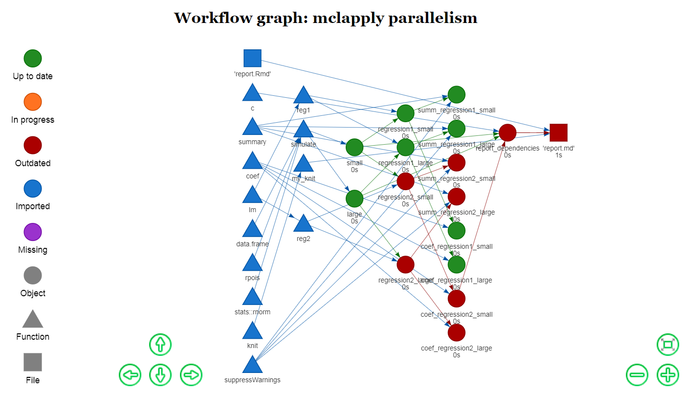

<p align="center">
  
</p>
<br/>

[](https://github.com/ropensci/onboarding/issues/156)
[](http://cran.r-project.org/package=drake)
[](http://cran.rstudio.com/package=drake)
[](https://www.gnu.org/licenses/gpl-3.0.en.html)
[](https://cran.r-project.org/)
[](https://travis-ci.org/wlandau-lilly/drake)
[](https://ci.appveyor.com/project/wlandau-lilly/drake)
[](https://codecov.io/github/wlandau-lilly/drake?branch=master)

# Data frames in R for [Make](http://kbroman.org/minimal_make/)

Drake is a workflow manager and build system for

1. [Reproducibility](https://CRAN.R-project.org/view=ReproducibleResearch).
2. [High-performance computing](https://CRAN.R-project.org/view=HighPerformanceComputing).

Organize your work in a data frame.

```r
library(drake)
load_basic_example()
my_plan
```

```r
##                    target                                      command
## 1             'report.md'             knit('report.Rmd', quiet = TRUE)
## 2                   small                                  simulate(5)
## 3                   large                                 simulate(50)
## 4       regression1_small                                  reg1(small)
## 5       regression1_large                                  reg1(large)
## 6       regression2_small                                  reg2(small)
## 7       regression2_large                                  reg2(large)
## 8  summ_regression1_small suppressWarnings(summary(regression1_small))
## 9  summ_regression1_large suppressWarnings(summary(regression1_large))
## 10 summ_regression2_small suppressWarnings(summary(regression2_small))
## 11 summ_regression2_large suppressWarnings(summary(regression2_large))
## 12 coef_regression1_small              coefficients(regression1_small)
## 13 coef_regression1_large              coefficients(regression1_large)
## 14 coef_regression2_small              coefficients(regression2_small)
## 15 coef_regression2_large              coefficients(regression2_large)
```

Then `make()` it to build all your targets.

```r
make(my_plan)
```

If a target fails, diagnose it.

```r
failed()                 # Targets that failed in the most recent `make()`
diagnose()               # Targets that failed in any previous `make()`
error <- diagnose(large) # Most recent verbose error log of `large`
str(error)               # Object of class "error"
error$calls              # Call stack / traceback
```

# Installation

You can choose among different versions of `drake`:

```r
install.packages("drake")                                  # Latest CRAN release.
install.packages("devtools")                               # For installing from GitHub.
library(devtools)
install_github("wlandau-lilly/drake@v4.4.0", build = TRUE) # Choose a GitHub tag/release.
install_github("wlandau-lilly/drake", build = TRUE)        # Development version.
```

- You must properly install `drake` using `install.packages()`, `devtools::install_github()`, or similar. It is not enough to use `devtools::load_all()`, particularly for the parallel computing functionality, in which multiple R sessions initialize and then try to `require(drake)`.
- For `make(..., parallelism = "Makefile")`, Windows users need to download and install [`Rtools`](https://cran.r-project.org/bin/windows/Rtools/).
# Quickstart

```r
library(drake)
config <- load_basic_example() # Also (over)writes report.Rmd. See drake_config().
vis_drake_graph(config)        # Click, drag, pan, hover. See arguments 'from' and 'to'.
outdated(config)               # Which targets need to be (re)built?
missed(config)                 # Are you missing anything from your workspace?
check_plan(my_plan)            # Are you missing files? Is your workflow plan okay?
config <- make(my_plan)        # Run the workflow.
diagnose(large)                # View error info if the target "large" failed to build.
outdated(config)               # Everything is up to date.
vis_drake_graph(config)        # The graph also shows what is up to date.
```

Dive deeper into the built-in examples.

```r
drake_example("basic") # Write the code files of the canonical tutorial.
drake_examples()       # List the other examples.
vignette("quickstart") # https://cran.r-project.org/package=drake/vignettes/quickstart.html
```

# Useful functions

`make()`, `plan_drake()`, `failed()`, and `diagnose()` are the most important functions. Beyond that, there are functions to learn about drake,

```r
load_basic_example()
drake_tip()
drake_examples()
drake_example()
```

set up your workflow plan data frame,

```r
plan_drake()
plan_analyses()
plan_summaries()
evaluate_plan()
expand_plan()
gather_plan()
wildcard() # From the wildcard package.
```

explore the dependency network,
```r
outdated()
missed()
vis_drake_graph() # Same as drake_graph().
dataframes_graph()
render_drake_graph()
read_drake_graph()
deps()
knitr_deps()
tracked()
```

interact with the cache,
```r
clean()
drake_gc()
cached()
imported()
built()
readd()
loadd()
find_project()
find_cache()
```

make use of recorded build times,

```r
build_times()
predict_runtime()
rate_limiting_times()
```

speed up your project with parallel computing,

```r
make() # with jobs > 2
max_useful_jobs()
parallelism_choices()
shell_file()
```

finely tune the caching and hashing,

```r
available_hash_algos()
cache_path()
cache_types()
configure_cache()
default_long_hash_algo()
default_short_hash_algo()
long_hash()
short_hash()
new_cache()
recover_cache()
this_cache()
type_of_cache()
```

and debug your work.
```r
check_plan()
drake_config()
read_drake_config()
diagnose()
dependency_profile()
in_progress()
progress()
rescue_cache()
drake_session()
```

# Reproducibility 

Reproducibility carries the promise that your output matches your input. Your tables, figures, reports, and intermediate objects should stay up to date with all the underlying data and code. To ensure internal consistency, `drake` detects and refreshes the outdated components of your project.

```r
library(drake)
config <- load_basic_example()
outdated(config)        # Which targets need to be (re)built?
config <- make(my_plan) # Build what needs to be built.
outdated(config)        # Everything is up to date.
reg2 <- function(d){    # Change one of your functions.
  d$x3 <- d$x ^ 3
  lm(y ~ x3, data = d)
}
outdated(config)        # Some targets depend on reg2().
vis_drake_graph(config) # See arguments 'from' and 'to'.
config <- make(my_plan) # Rebuild just the outdated targets.
outdated(config)        # Everything is up to date again.
vis_drake_graph(config) # The colors changed in the graph.
```

Similarly to imported functions like `reg2()`, `drake` reacts to changes in

1. Other imported functions, whether user-defined or from packages.
1. For imported functions from your environment, any nested functions also in your environment or from packages.
1. Commands in your workflow plan data frame.
1. Global variables mentioned in the commands or imported functions.
1. Upstream targets.
1. For [dynamic knitr reports](https://yihui.name/knitr) (with `knit('your_report.Rmd')` as a command in your workflow plan data frame), targets and imports mentioned in calls to `readd()` and `loadd()` in the code chunks to be evaluated. `Drake` treats these targets and imports as dependencies of the compiled output target (say, 'report.md').

With alternate [triggers](https://github.com/wlandau-lilly/drake/blob/master/vignettes/debug.Rmd#test-with-triggers) and the [option to skip imports](https://github.com/wlandau-lilly/drake/blob/master/vignettes/debug.Rmd#skipping-imports), you can sacrifice reproducibility to gain speed. However, these options throw the dependency network out of sync. You should only use them for testing and debugging, never for production.

```r
make(..., skip_imports = TRUE, trigger = "missing")
```

Using different tools, you can enhance reproducibility beyond the scope of `drake`. [Packrat](https://rstudio.github.io/packrat) creates a tightly-controlled local library of packages to extend the shelf life of your project. And with [Docker](https://www.docker.com/), you can execute your project on a [virtual machine](https://en.wikipedia.org/wiki/Virtual_machine) to ensure platform independence. Together, [packrat](https://rstudio.github.io/packrat) and [Docker](https://www.docker.com/) can help others reproduce your work even if they have different software and hardware.

# High-performance computing

Similarly to [Make](https://www.gnu.org/software/make/), drake arranges the intermediate steps of your workflow in a dependency network. This graph is the key to `drake`'s approach to high-performance computing.

```{r basicgraph}
library(drake)
load_basic_example()
config <- make(my_plan, jobs = 2) # See also max_useful_jobs(my_plan).
# Change a dependency.
reg2 <- function(d){
  d$x3 <- d$x ^ 3
  lm(y ~ x3, data = d)
}
# Run vis_drake_graph() yourself for interactivity.
# Then hover, click, drag, pan, and zoom.
vis_drake_graph(config, width = "100%")
```



Within each column above, the nodes are conditionally independent given their dependencies. Each `make()` walks through the columns from left to right and applies parallel processing within each column. If any nodes are already up to date, `drake` looks downstream to maximize the number of outdated targets in a parallelizable stage. To show the parallelizable stages of the next `make()` programmatically, use the `parallel_stages()` function.

Parallel computing backends range from local multicore computing to [future.batchtools](https://github.com/HenrikBengtsson/future.batchtools)-powered distributed computing. Please see the [parallelism vignette](https://github.com/wlandau-lilly/drake/blob/master/vignettes/parallelism.Rmd) for details.

```r
vignette("parallelism") 
```

# Acknowledgements and related work

The original idea of a time-saving reproducible build system extends back at least as far as [GNU Make](http://kbroman.org/minimal_make/), which still aids the work of [data scientists](http://blog.kaggle.com/2012/10/15/make-for-data-scientists/) as well as the original user base of complied language programmers. In fact, the name "drake" stands for "Data Frames in R for Make".

Today, there is a [whole ecosystem of pipeline toolkits](https://github.com/pditommaso/awesome-pipeline), mostly written in Python. Of all the toolkits in the list, [Rich FitzJohn](http://richfitz.github.io/)'s [remake package](https://github.com/richfitz/remake) is by far the most important for `drake`. `Drake` stands squarely on the shoulders of [remake](https://github.com/richfitz/remake), borrowing the fundamental concepts and extending them in a fresh implementation with a convenient interface and high-performance computing.

Many thanks to the following people for contributing amazing ideas and code patches early in the development of `drake` and its predecessors [parallelRemake](https://github.com/wlandau/parallelRemake) and [remakeGenerator](https://github.com/wlandau/remakeGenerator).

- [Alex Axthelm](https://github.com/AlexAxthelm)
- [Chan-Yub Park](https://github.com/mrchypark)
- [Daniel Falster](https://github.com/dfalster)
- [Eric Nantz](https://github.com/enantz-lilly)
- [Henrik Bengtsson](https://github.com/HenrikBengtsson)
- [Jasper Clarkberg](https://github.com/dapperjapper)
- [Kendon Bell](https://github.com/kendonB)
- [Kirill M&uuml;ller](https://github.com/krlmlr)

Special thanks to [Jarad Niemi](http://www.jarad.me/), my advisor from [graduate school](http://stat.iastate.edu/), for first introducing me to the idea of [Makefiles](https://www.gnu.org/software/make/) for research. It took several months to convince me, and I am glad he succeeded.

# Documentation

`Drake` has [multiple vignettes](https://github.com/wlandau-lilly/drake/tree/master/vignettes), and the [CRAN page](https://CRAN.R-project.org/package=drake) links to rendered versions.

```r
vignette(package = "drake") # List the vignettes.
vignette("caution")         # Avoid common pitfalls.
vignette("debug")           # Debugging and testing.
vignette("drake")           # High-level intro.
vignette("graph")           # Visualilze the workflow graph.
vignette("quickstart")      # Walk through a simple example.
vignette("parallelism")     # High-performance computing.
vignette("storage")         # Learn how drake stores your stuff.
vignette("timing")          # Build times, runtime predictions
```

# Help and troubleshooting

Please refer to [TROUBLESHOOTING.md](https://github.com/wlandau-lilly/drake/blob/master/TROUBLESHOOTING.md) on the [GitHub page](https://github.com/wlandau-lilly/drake) for instructions.

# Contributing

Bug reports, suggestions, and code are welcome. Please see [CONTRIBUTING.md](https://github.com/wlandau-lilly/drake/blob/master/CONTRIBUTING.md). Maintainers and contributors must follow this repository's [code of conduct](https://github.com/wlandau-lilly/drake/blob/master/CONDUCT.md).
