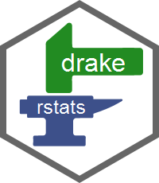

```{r suppression, echo = F}
suppressMessages(suppressWarnings(library(drake)))
clean(destroy = TRUE)
unlink(c("Makefile", "report.Rmd", "shell.sh", "STDIN.o*", "Thumbs.db"))
```

# Quick examples

Inspect and run your project.

```{r quickstartquickstart, eval = FALSE}
library(drake)
load_basic_example() # Also (over)writes report.Rmd.
plot_graph(my_plan) # Hover, click, drag, zoom, pan. See args 'from' and 'to'.
make(my_plan) # Run the workflow.
outdated(my_plan) # Check that everything is already up to date.
```

Debug errors.

```{r quickdebug, eval = FALSE}
failed()                 # Targets that failed in the most recent `make()`
diagnose()               # Targets that failed in any previous `make()`
error <- diagnose(large) # Most recent verbose error log of `large`
str(error)               # Object of class "error"
error$calls              # Call stack / traceback
```

Dive deeper into the built-in examples.

```{r noeval2, eval = FALSE}
example_drake("basic") # Write the code files.
examples_drake() # List the other examples.
vignette("quickstart") # This vignette
```

# Setting up the basic example

Let's establish the building blocks of a data analysis workflow.

```{r libs}
library(knitr)
library(drake)
```

First, we will generate a few datasets.

```{r sim}
simulate <- function(n){
  data.frame(
    x = stats::rnorm(n),
    y = rpois(n, 1)
  )
}
```

Then, we will analyze each dataset with multiple analysis methods.

```{r reg}
reg1 <- function(d){
  lm(y ~ + x, data = d)
}

reg2 <- function(d){
  d$x2 <- d$x ^ 2
  lm(y ~ x2, data = d)
}
```

We need the source file `report.Rmd` for the end.k

```{r file}
lines <- c(
  "---",
  "title: Example Report",
  "author: You",
  "output: html_document",
  "---",
  "",
  "Look how I read outputs from the drake cache.",
  "Drake notices that `small`, `coef_regression2_small`,",
  "and `large` are dependencies of the",
  "future compiled output report file target, `report.md`.",
  "Just be sure that the workflow plan command for the target `'report.md'`",
  "has an explicit call to `knit()`, something like `knit('report.Rmd')` or",
  "`knitr::knit(input = 'report.Rmd', quiet = TRUE)`.",
  "",
  "```{r example_chunk}",
  "library(drake)",
  "readd(small)",
  "readd(coef_regression2_small)",
  "loadd(large)",
  "head(large)",
  "```")
writeLines(lines, "report.Rmd")
```

# Workflow plan

The workflow plan lists the intermediate steps of your project.

```{r previewmyplan}
load_basic_example()
my_plan
```

Each row is an intermediate step, and each **command** generates a **target**. A target is an output R object (cached when generated) or output file (specified with single quotes), and a command just an ordinary piece of R code (not necessarily a single function call). As input, commands may take objects imported from your workspace, targets generated by other commands, or initial input files. These dependencies give your project an underlying network.

```{r graph1quick, eval = FALSE}
# Hover, click, drag, zoom, and pan.
plot_graph(my_plan, width = "100%", height = "500px")
```

<iframe
src = "https://cdn.rawgit.com/wlandau-lilly/drake/2211b300/images/outdated.html"
width = "100%" height = "600px" allowtransparency="true"
style="border: none; box-shadow: none">
</iframe>

See also `dataframes_graph()`, `render_graph()`, and `config()` for faster and more customized regraphing.

You can also check the dependencies of individual targets.

```{r checkdeps}
deps(reg2)
deps(my_plan$command[1]) # Files like report.Rmd are single-quoted.
deps(my_plan$command[nrow(my_plan)])
```

List all the reproducibly-tracked objects and files, including imports and targets.

```{r tracked}
tracked(my_plan, targets = "small")
tracked(my_plan)
```

Check for cycles, missing input files, and other pitfalls.

```{r check}
check(my_plan)
```

# Generate the workflow plan

The data frame `my_plan` would be a pain to write by hand, so `drake` has functions to help you.

```{r datasets}
my_datasets <- workplan(
  small = simulate(5),
  large = simulate(50))
my_datasets
```

For multiple replicates:

```{r expand}
expand(my_datasets, values = c("rep1", "rep2"))
```

Each dataset is analyzed multiple ways.

```{r methods}
methods <- workplan(
  regression1 = reg1(..dataset..), # nolint
  regression2 = reg2(..dataset..)) # nolint
methods
```

We evaluate the `..dataset..` wildcard.

```{r analyses}
my_analyses <- analyses(methods, data = my_datasets)
my_analyses
```

Next, we summarize each analysis of each dataset using summary statistics and regression coefficients.

```{r summaries}
summary_types <- workplan(
  summ = suppressWarnings(summary(..analysis..)), # nolint
  coef = coefficients(..analysis..)) # nolint
summary_types

results <- summaries(summary_types, analyses = my_analyses,
  datasets = my_datasets, gather = NULL)
results
```

The `gather` feature groups summaries into a smaller number of more manageable targets. I shut it off here to make the data frames more readable.

For the dynamic report, we have to make sure the files are single-quoted. Single quotes denote file targets and file imports, and double quotes denote literal strings that should not be treated as dependencies where they are mentioned. Also, `knit()` needs to be somewhere visible in the workflow plan command so that `drake` knows to dig into the active code chunks of `'report.Rmd'` and look for dependencies mentioned in calls to `loadd()` and `readd()`.

```{r reportplan}
report <- workplan(
  report.md = knit('report.Rmd', quiet = TRUE), # nolint
  file_targets = TRUE, strings_in_dots = "filenames")
report
```

Finally, gather your workflow together with `rbind()`. Row order does not matter.

```{r wholeplan}
my_plan <- rbind(report, my_datasets, my_analyses, results)
my_plan
```

# Flexible helpers to make workflow plans

If your workflow does not fit the rigid datasets/analyses/summaries framework, check out functions `expand()`, `evaluate()`, and `gather()`.

```{r more_expansions_and_plans}
df <- workplan(data = simulate(center = MU, scale = SIGMA))
df
df <- expand(df, values = c("rep1", "rep2"))
df
evaluate(df, wildcard = "MU", values = 1:2)
evaluate(df, wildcard = "MU", values = 1:2, expand = FALSE)
evaluate(df, rules = list(MU = 1:2, SIGMA = c(0.1, 1)), expand = FALSE)
evaluate(df, rules = list(MU = 1:2, SIGMA = c(0.1, 1, 10)))
gather(df)
gather(df, target = "my_summaries", gather = "rbind")
```

# Run the workflow

You may want to check for outdated or missing targets/imports first.

```{r firstmake}
outdated(my_plan, verbose = FALSE) # Targets that need to be (re)built.
missed(my_plan, verbose = FALSE) # Checks your workspace.
```

Then just `make(my_plan)`.

```{r firstmakeforreal}
make(my_plan)
```

The non-file dependencies of your last target are already loaded in your workspace.

```{r autoload}
ls()
```

```{r plotgraphfirstmake}
outdated(my_plan, verbose = FALSE) # Everything is up to date.
build_times(digits = 4) # How long did it take to make each target?
```

See also `predict_runtime()` and `rate_limiting_times()`.

In the new graph, the red nodes from before are now green.

```{r graph2quick, eval = FALSE}
# Hover, click, drag, zoom, and pan.
plot_graph(my_plan, width = "100%", height = "500px")
```

<iframe
src = "https://cdn.rawgit.com/wlandau-lilly/drake/2211b300/images/built.html"
width = "100%" height = "600px" allowtransparency="true"
style="border: none; box-shadow: none">
</iframe>

Optionally, get `visNetwork` nodes and edges so you can make your own plot with `visNetwork` or `render_graph()`.

```{r dfgraph2quick, eval = FALSE}
dataframes_graph(my_plan)
```

Use `readd()` and `loadd()` to load more targets. (They are cached in the hidden `.drake/` folder using [storr](https://CRAN.R-project.org/package=storr)). Other functions interact and view the cache.

```{r cache}
readd(coef_regression2_large)
loadd(small)
head(small)
rm(small)
cached(small, large)
cached()
built()
imported()
head(read_plan())
head(progress()) # See also in_progress()
progress(large)
session() # of the last call to make()
```

The next time you run `make(my_plan)`, nothing will be built because drake knows everything is up to date.

```{r uptodateinvig}
make(my_plan)
```

But if you change one of your functions, commands, or other dependencies, drake will update the affected parts of the workflow. Let's say we want to change the quadratic term to a cubic term in our `reg2()` function.

```{r changereg2invignette}
reg2 <- function(d) {
  d$x3 <- d$x ^ 3
  lm(y ~ x3, data = d)
}
```

The targets depending on `reg2()` need to be rebuilt and everything else is left alone.

```{r plotwithreg2}
outdated(my_plan, verbose = FALSE)
```

```{r graph3quick, eval = FALSE}
# Hover, click, drag, zoom, and pan.
plot_graph(my_plan, width = "100%", height = "500px")
```

<iframe
src = "https://cdn.rawgit.com/wlandau-lilly/drake/2211b300/images/reg2.html"
width = "100%" height = "600px" allowtransparency="true"
style="border: none; box-shadow: none">
</iframe>


```{r remakewithreg2}
make(my_plan)
```

But trivial changes to whitespace and comments are totally ignored in your functions and in `my_plan$command`.

```{r trivial}
reg2 <- function(d) {
  d$x3 <- d$x ^ 3
    lm(y ~ x3, data = d) # I indented here.
}
outdated(my_plan, verbose = FALSE) # Everything is up to date.
```

Need to add new work on the fly? Just append rows to the workflow plan. If the rest of your workflow is up to date, only the new work is run.

```{r newstuff}
new_simulation <- function(n){
  data.frame(x = rnorm(n), y = rnorm(n))
}

additions <- workplan(
  new_data = new_simulation(36) + sqrt(10))
additions

my_plan <- rbind(my_plan, additions)
my_plan

make(my_plan)
```

If you ever need to erase your work, use `clean()`. Any targets removed from the cache will have to be rebuilt on the next call to `make()`, so be careful.

```{r cleanup}
clean(small, reg1) # uncaches individual targets and imported objects
clean() # cleans all targets out of the cache
clean(destroy = TRUE) # removes the cache entirely
```

# Automatic watching for changed dependencies

As you have seen with `reg2()`, `drake` reacts to changes. In other words, `make()` notices when your dependencies are different from last time, rebuilds any affected targets, and continues downstream. In particular, `drake` watches for nontrivial changes to

1. Other imported functions, whether user-defined or from packages.
1. For imported functions from your environment, any nested functions also in your environment or from packages.
1. Commands in your workflow plan data frame.
1. Global variables mentioned in the commands or imported functions.
1. Upstream targets.
1. For [dynamic knitr reports](https://yihui.name/knitr/) (with `knit('your_report.Rmd')` as a command in your workflow plan data frame), targets and imports mentioned in calls to `readd()` and `loadd()` in the code chunks to be evaluated. `Drake` treats these targets and imports as dependencies of the compiled output target (say, 'report.md').

To explore the dependencies, please refer to the `deps()` and `tracked()` functions. Better yet, generate interactive graphs with `plot_graph()` as shown above. Hover over the nodes in the graph to see the content that `drake` watches.

There is more to reproducibility than just using `drake` to watch for dependencies. [Packrat](https://rstudio.github.io/packrat) creates a tightly-controlled local library of packages to extend the shelf life of your project. And with [Docker](https://www.docker.com/), you can execute your project on a [virtual machine](https://en.wikipedia.org/wiki/Virtual_machine) to ensure platform independence. Together, [packrat](https://rstudio.github.io/packrat) and [Docker](https://www.docker.com/) can help others reproduce your work even if they have different software and hardware.

# Need more speed?

`Drake` has extensive high-performance computing support, from local multicore computing on your laptop to serious supercomputing across multiple nodes of a large cluster. See the [parallelism vignette](https://github.com/wlandau-lilly/drake/blob/master/vignettes/parallelism.Rmd) for the full details.

```{r endofline_quickstart, echo = F}
clean(destroy = TRUE)
unlink(c("Makefile", "report.Rmd", "shell.sh", "STDIN.o*", "Thumbs.db"))
```
